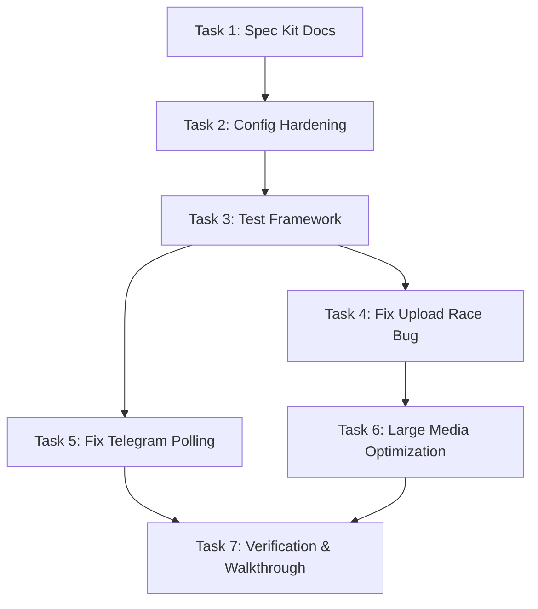

# Feature & Task Dependency Map

This document defines the dependency relationships across the unfinished work and enhancement tasks.

---

## 1. Task Dependency Graph

---

## 2. Dependency Matrix

| Task ID | Description | Pre-requisites | Blocks |
| :--- | :--- | :--- | :--- |
| **Task 1** | Spec Kit Suite Docs | None | Task 2 |
| **Task 2** | Config & Secret Hardening | Task 1 | Task 3 |
| **Task 3** | Automated Testing Framework | Task 2 | Task 4, Task 5 |
| **Task 4** | Fix Upload Race Condition | Task 3 | Task 6 |
| **Task 5** | Fix Telegram Polling | Task 3 | Task 7 |
| **Task 6** | Large Media Optimization | Task 4 | Task 7 |
| **Task 7** | Verification & Walkthrough | Task 5, Task 6 | None (Final) |

---

## 3. Critical Path Analysis
- The **critical path** is: `Task 1 -> Task 2 -> Task 3 -> Task 4 -> Task 6 -> Task 7`.
- `Task 5` (Telegram Polling) can be executed in parallel with `Task 4` and `Task 6`.
- Automated testing (`Task 3`) is established before fixing application bugs (`Task 4` and `Task 5`) to guarantee no regression of existing functionality.
