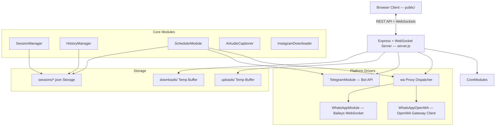
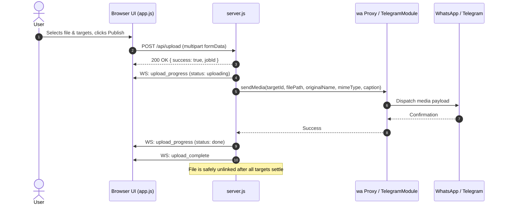
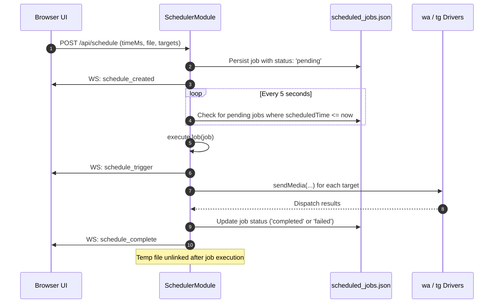

# Technical Architecture Plan

This document details the architectural design and execution flow based strictly on the **current Node.js + Express + WebSocket + Vanilla JS technology stack**.

---

## 1. System Architecture Diagram

---

## 2. Component Responsibilities

### 2.1 Backend Pipeline (`server.js`)
- **Express Layer**: Handles CORS, static asset delivery, file ingestion via `multer`, JSON body parsing, and error normalization.
- **WebSocket Hub**: Broadcasts status changes, real-time download and upload progress, QR code data URIs, and scheduler events to all connected clients.
- **Proxy Dispatcher (`wa`)**: Directs calls (`connect()`, `sendMedia()`, `getGroups()`, etc.) to the currently active WhatsApp engine (`openwa` or `baileys`) according to `session_config.json`.

### 2.2 Core Modules (`modules/`)
1. **`session_manager.js`**: Reads and updates `sessions/session_config.json`, tracking `rememberMe`, engine mode, and auto-connect credentials.
2. **`history.js`**: Manages `sessions/target_history.json`, deduplicating target records and sorting by `lastConnected`.
3. **`scheduler.js`**: Background polling loop (every 5 seconds) scanning `sessions/scheduled_jobs.json`. Executes jobs via `wa` and `tg` drivers when `scheduledTime <= Date.now()`.
4. **`instagram_downloader.js`**: Implements 8-candidate fallback extraction sequence for Instagram reels/posts without requiring login cookies.
5. **`ai_audio_captioner.js`**: Synthesizes social media captions and contextual hashtags based on metadata, transcripts, and selected style presets.
6. **`telegram.js`**: Connects via `node-telegram-bot-api`, tracks administrator chats, auto-approves join requests, and dispatches media with document fallback.

---

## 3. Data Flow Diagrams

### 3.1 Media Upload & Broadcast Flow

### 3.2 Scheduled Broadcast Execution Flow

---

## 4. Key Refactorings for Stability & Scalability

1. **Upload File Cleanup Lifecycle**:
   - Instead of a blind `setTimeout(..., 10000)`, track the lifecycle of the active upload job and only unlink after all target promises settle.
2. **Environment Variable Secret Resolution**:
   - Ensure all credentials default to `process.env` with graceful warnings if absent.
3. **Automated Testing Harness**:
   - Establish non-intrusive unit and API tests in `test/` using `node:test`.
